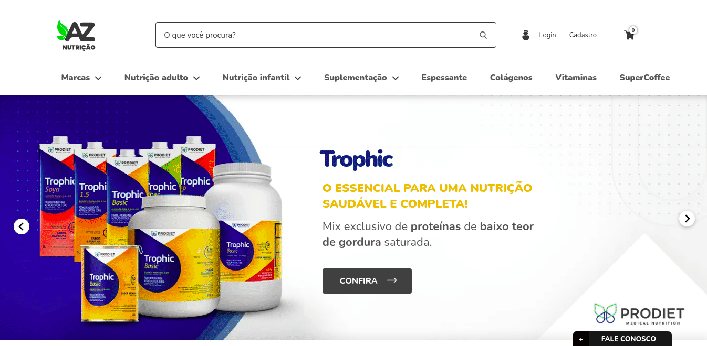

<h1>
    
</h1>

# AZ Nutrição

<h4>?? Projeto em construção... ??</h4>

 

Projeto de desenvolvimento de um sistema de e-commerce para a empresa AZ Nutrição.

O projeto usa a plataforma de Tray Commerce, seguindo suas normas de desenvolvimento. Desse modo, as tecnologias utilizadas são:

<ul>
    <li>
        <strong>PHP + <a href="#">Twig</a> para o backend</strong>
    </li>
    <li>
        <strong>SASS, jQuery e a API da Tray para o frontend</strong>
    </li>
</ul>

<h1 align="center">
    
</h1>

## Features
### Requisitos funcionais
- [x] Login
- [x] Registro
- [x] Adicionar produto ao carrinho
- [x] Remover produto do carrinho
- [] Calcular frete
- [x] Selecionar variação de produto na página do produto
- [x] Selecionar variação de produto no card do produto
- [x] Adicionar/remover variação de produtoao carrinho
- [x] Abrir galeria do produto (zoom da foto do produto)
- [x] Menu interativo (categorias e subcateorias navegáveis)
- [x] Menu minimizado ao rolar a página
- [x] Chat
- [x] Cálculo do valor total do carrinho em tempo real
- [x] Deletar produto do carrinho via gesto no mobile (arrastar para o lado para deletar)
- [x] Vitrines de produtos na home
- [x] Filtros de produtos nas páginas de categorias (mudam de acordo com a categorias selecionada)

### Requisitos não funcionais
- [x] <a href="#">Os elementos da interface devem ser componentizados</a>
- [x] O projeto deve seguir as práticas da documentação da plataforma Tray Commerc, disponível em <a href= "#">Documentação Tray</a>
- [] Todos os componentes de interface e páginas do sistema devem ser responsivos
- [x] O projeto deve ser desenvolvido seguindo as regras do Mobile First
- [] Todas as imagens utilizadas devem ter tamanho e peso otimizados para dispositivos e rede móveis
- [] Todos os arquivos CSS e JS devem ser minificados
- [] O projeto bater pelo menos 80 pontos de desempenho no Google Audit
- [] Seguir as regras de desenvolvimento da Google para desempenho e SEO

